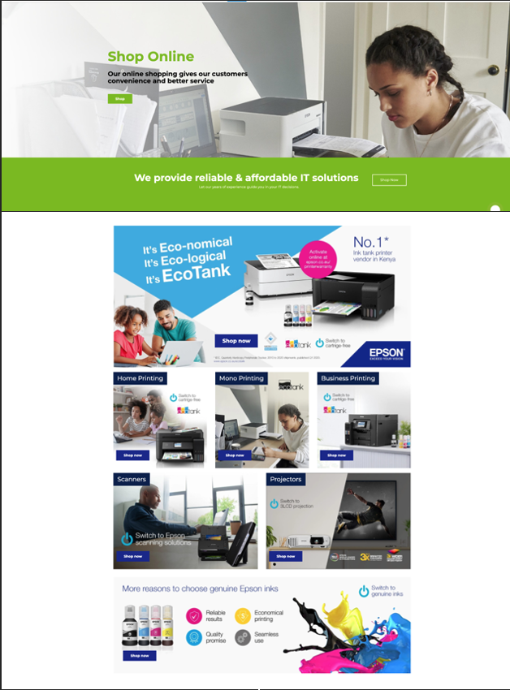

# smat-soft

## Table of Contents
1.  [**Project Goals**](#project-goals)
    - [**Design choices**](#design-choices)

2. [**Technologies used**](#technologies-used)

3. [**Testing**](#testing)

### Project Goals

I created a page for SmatSoft which includes various Epson printers. 

### Design Choices

Proofing link can be found here:
<a href="https://proofing.xigen.co.uk/clients/smatsoft/smatsoft.html" target="_blank">Proofing link</a>

### Screenshot of the page
- Here are the screenshots: 
    

     
    

## Technologies and Code Used

- This project uses HTML and CSS.
- [Visual Studio Code](https://code.visualstudio.com/) 
    - Developer used **Visual Studio Code** to create the Landing page. 
- [Proofing](https://proofing.xigen.co.uk/clients/smatsoft/smatsoft.html)
    - Link is done via proofing

## Testing 

Testing information can be found in separate [testing.md](testing.md) file as well as [BrowserStack](https://www.browserstack.com). 

## Credits

### Content

- All text in this project was written by the developer.

#### Disclaimer

Thank you for taking your time to read this. 

Afra. 
